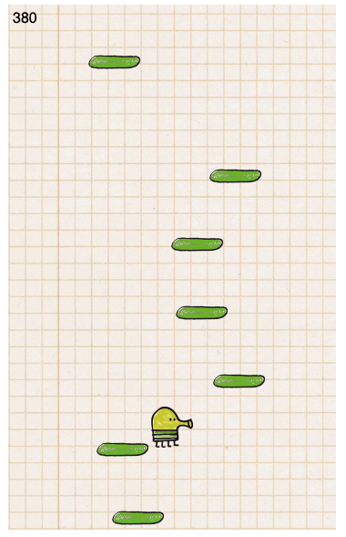

# DoodleJump Game

## Screen Shot

## Description

DoodleJump is a fun and engaging browser-based game created using HTML, CSS, and JavaScript. It's a simple yet addictive game where the player controls a doodle character, making it jump from one platform to another while avoiding obstacles and collecting power-ups. The objective is to score as high as possible without falling.

## Installation

To set up DoodleJump locally:

1. Clone the repository to your local machine.
2. Open `doodleJump.html` in your preferred web browser.

## Usage

To play the game, use the arrow keys to move the doodle character left or right. The game gets progressively faster and more challenging as your score increases.

## Technologies Used

- HTML
- CSS
- JavaScript

## Contributing

Contributions to the DoodleJump game are welcome! If you have suggestions or improvements, feel free to fork this repository and submit a pull request.
